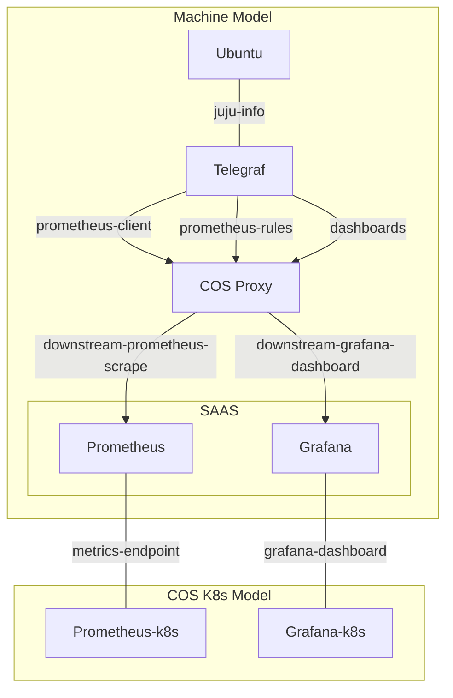
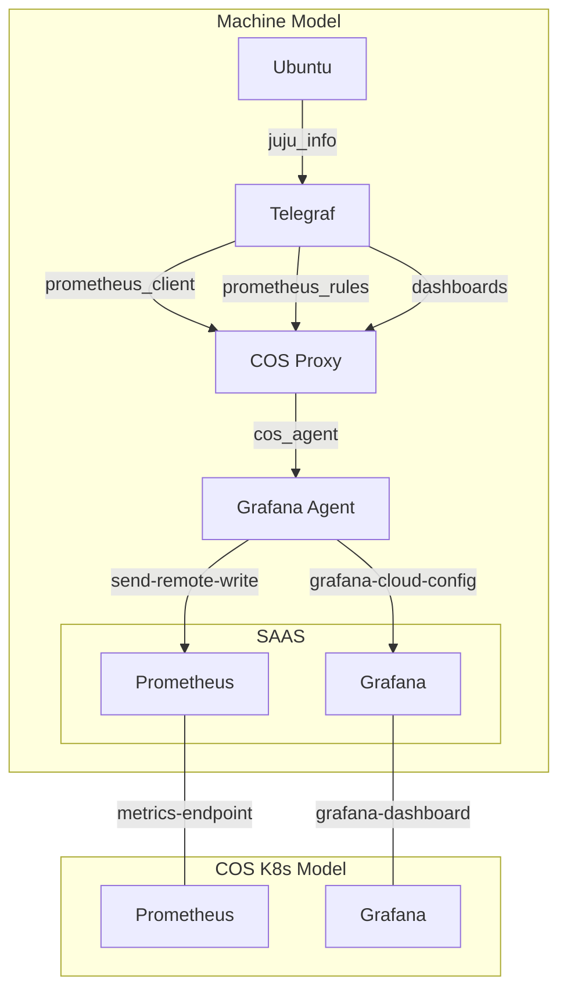

## Topology

Below diagrams illustrate how to integrate `cos-proxy` with `cos-lite` charms to monitor legacy (LMA) charms.

### Integration with COS Proxy

In the topology diagrams:

1. **Direct Integration**: The first diagram shows `cos-proxy` directly interacting with offered SAAS relations from `cos-lite`.

2. **Over the COS Agent Interface**: The second diagram demonstrates integration via the grafana-agent's `cos-agent` interface, which receives metrics and dashboards configurations from `cos-proxy`. `grafana-agent` then sends remote writes to `Prometheus` and dashboards configuration data to `Grafana` via the offered SAAS relations from `cos-lite`.

**Important Note**: Applications should not be directly linked to `cos-proxy` via the `juju-info` relation. Instead, they should interact with a charm similar to`telegraf` for metric collection, which is then handled by `cos-proxy`.

## Relating directly to cos-proxy

## Relating over the cos-agent interface

