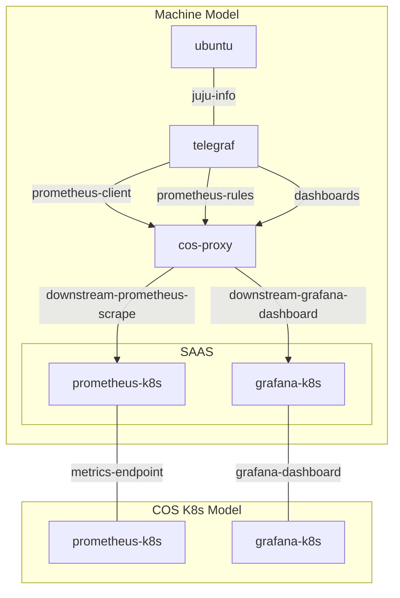
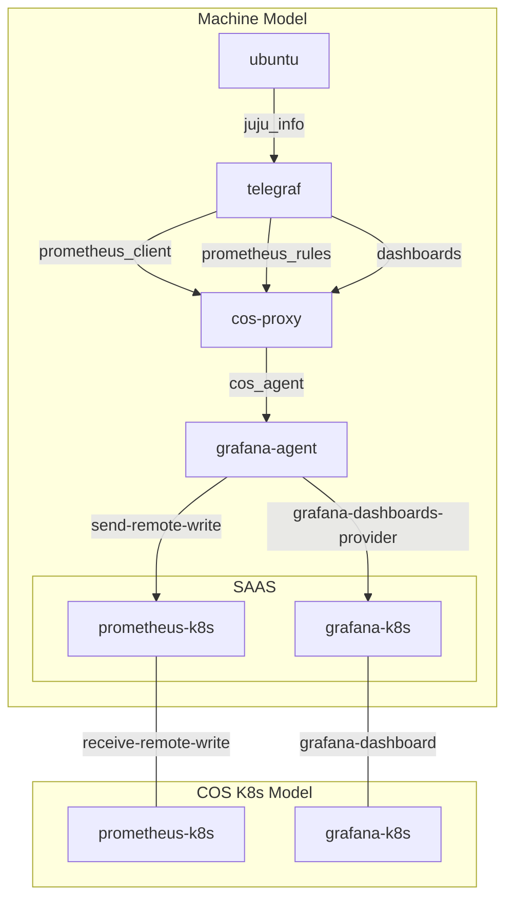

## Background

The diagrams below illustrate how to integrate `cos-proxy` with `cos-lite` charms to monitor legacy (LMA) charms. `cos-proxy` serves as an intermediary solution, helping to bridge the gap between legacy charms and modern `cos-lite`. However, it's essential to note that `cos-proxy` is a **transitional** solution, and whenever possible, you should directly use `grafana-agent`. For more information on integrating with `grafana-agent`, refer to the [gagent INTEGRATING documentation](https://github.com/canonical/grafana-agent-operator/blob/main/INTEGRATING.md).

Please refer to the [`juju exported bundles`](tests/manual/topologies/README.md) to verify the deployment of the below topologies in a test environment.

**Important Note**: Applications should not be directly linked to `cos-proxy` via the `juju-info` relation. Instead, they should interact with a charm similar to`telegraf` for metric collection, which is then handled by `cos-proxy`.

## Relating directly to cos-proxy

Diagram below shows `cos-proxy` directly interacting with offered SAAS relations from `cos-lite`.

This topology is **discouraged** in favor of a more modern approach. Whenever possible, use the `grafana-agent` charm if your application supports the `cos-agent` interface. `grafana-agent` provides a more direct integration path.

If your charm does not support the `cos-agent` interface, consider relating `cos-proxy` to `grafana-agent` as explained in the second graph. 

## Relating over the cos-agent interface

In this topology, integration is achieved via the `grafana-agent`'s `cos-agent` interface. Here, `cos-proxy` sends metrics and dashboard configurations to `grafana-agent`, which then forwards these to `Prometheus` and `Grafana` via the offered SAAS relations from `cos-lite`.

