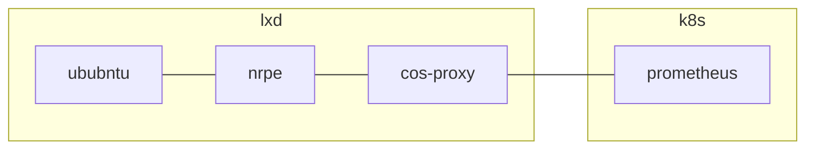

## Deploy
First deploy the [`k8s-bundle`](k8s-bundle.yaml) in a k8s model, and then deploy the
[`lxd-bundle`](lxd-bundle.yaml) in a lxd model.

## Verify
- Make sure rule files are available in prometheus:
  - relation data: `juju show-unit prom/0`
  - on disk: `juju ssh --container prometheus prom/0 ls /etc/prometheus/rules`
  - via http api: `curl x.x.x.x:9090/api/v1/rules | jq`
- Stop the nrpe-exporter service, `juju ssh cp/0 sudo systemctl stop nrpe-exporter`, and make sure:
  - All nrpe related targets are down, `curl x.x.x.x:9090/api/v1/targets | jq`
  - 10 minutes after stopping, alerts are firing:
    `curl x.x.x.x:9090/api/v1/rules | jq '.data.groups | .[].rules | .[] | select(.state == "firing")'`
  - Start the nrpe exporter, `juju ssh cp/0 sudo systemctl start nrpe-exporter`, and make sure
    the alerts are not firing anymore (need to wait for the scrape interval, 1m, to elapse).
